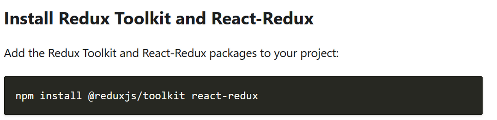

# Nextjs with reduxtoolkit

## Notes
- Redux toolkit is a library that helps you to use Redux in a more efficient way.
- It provides a set of tools to help you to manage your state in a more efficient way.
- It also provides a set of pre-built hooks that you can use to manage your state.
- Next.js is a React framework that provides a set of features to help you to build server-sid

## Installation

